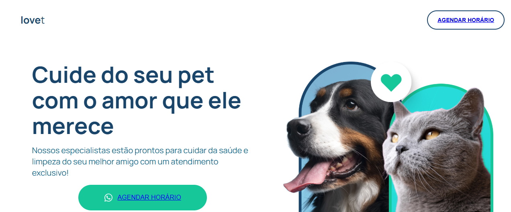

# 🐾 Projeto Full Stack - Pet Shop

Bem-vindo ao **Projeto Full Stack - Pet Shop**, uma aplicação simples e funcional desenvolvida para gerenciar agendamentos de serviços para pets. Este projeto foi construído utilizando **HTML**, **CSS**, **JavaScript**, **PHP** e **MySQL**.

## 📸 Captura de Tela



## 📋 Funcionalidades

- **Landing Page**: Uma página inicial atrativa que apresenta os serviços oferecidos.
- **Formulário de Agendamento**: Permite que os clientes agendem serviços para seus pets.
- **Página de Sucesso**: Exibe os dados do agendamento após o envio do formulário.
- **Banco de Dados**: Armazena os dados dos clientes e seus agendamentos.

## 🛠️ Tecnologias Utilizadas

- **Frontend**: HTML, CSS e JavaScript.
- **Backend**: PHP.
- **Banco de Dados**: MySQL.

## 📂 Estrutura do Projeto

- **config.php**: Configuração do banco de dados.
- **formulario.php**: Página do formulário de agendamento.
- **index.html**: Página inicial (Landing Page).
- **pet.sql**: Script SQL para criação da tabela.
- **sucesso.php**: Página de sucesso após o agendamento.
- **README.md**: Documentação do projeto.
- **assets/**: Imagens e ícones utilizados no projeto.
- **styles/**: Arquivos de estilo CSS.

## 🚀 Como Executar o Projeto

1. Clone este repositório:
   ```bash
   git clone https://github.com/seu-usuario/projeto-full-stack-pet-shop.git
   ```
2. Configure o banco de dados:
   - Crie um banco de dados chamado `pet`.
   - Importe o arquivo `pet.sql` para criar a tabela necessária.

3. Configure o arquivo `config.php` com as credenciais do seu banco de dados.

4. Inicie um servidor local (como o XAMPP ou WAMP) e coloque os arquivos na pasta `htdocs`.

5. Acesse o projeto no navegador:
   http://localhost/Projeto_full_stack/

     ---
   
## 📌 Melhorias Futuras

- Melhorar a estética do formulário e da página de sucesso.
- Adicionar validações mais robustas no backend.
- Implementar autenticação para gerenciar os agendamentos.

---

## 🤝 Contribuindo

Contribuições são bem-vindas!  
Se quiser sugerir melhorias ou reportar problemas, sinta-se à vontade para abrir uma **issue** ou enviar um **pull request**.  

---

## 📄 Licença

Este projeto está sob a licença MIT.  
Veja o arquivo **LICENSE** para mais detalhes.  

---

## 📫 Contato

- 📧 **Email**: hudson.henri10@gmail.com 
- 💼 **LinkedIn**: (https://www.linkedin.com/in/hudsonhenri)  
